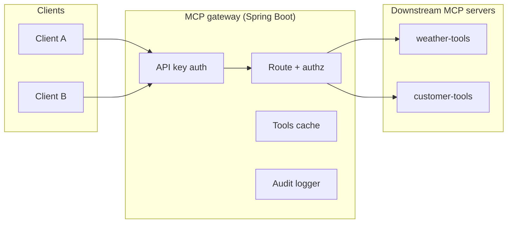
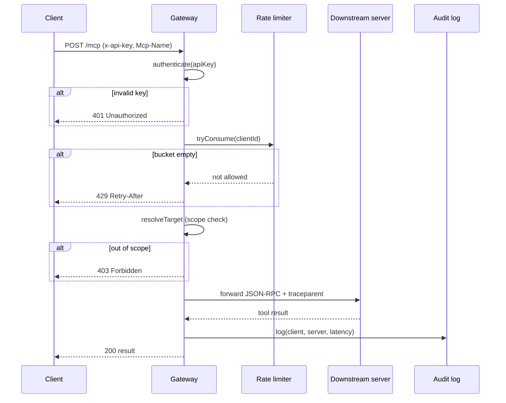

# MCP Gateway

A lightweight control-plane gateway for the [Model Context Protocol](https://modelcontextprotocol.io) (MCP), written in Java with Spring Boot.

## What this is

MCP standardizes how one AI client talks to one tool server. It says nothing about what happens once you have several agents and several internal tool servers — that's N×M point-to-point trust relationships, each server reimplementing its own auth, with no single place to answer "who called what, and should they have been allowed to."

This project is a small, working gateway that sits in front of multiple MCP tool servers and handles the cross-cutting concerns once, centrally:

- **Authentication** — one place to validate a caller's identity, not one per tool server
- **Per-client authorization** — scope which tool servers each caller can reach
- **Rate limiting** — a token bucket per client, so one runaway agent can't take down a shared tool server
- **Routing** — dispatches by the `Mcp-Name`/`Mcp-Method` headers from the MCP 2026-07-28 spec, so it can sit behind an ordinary load balancer with no session affinity
- **Aggregated discovery** — one `/discovery` call returns the merged, TTL-cached tool catalog across every server a client is authorized for
- **Audit logging** — a structured, metadata-only trail of every call: who, what, which server, how long, allowed or denied

## Why it matters

Enterprise teams are actively building the governance layer for agentic AI right now, and the pattern rhymes with API gateway and service-mesh adoption a decade ago — new protocol, same underlying problem. This repo is a compact, readable reference for that pattern: enough to run end-to-end locally, small enough to read in one sitting, and deliberately hand-rolled (rather than built on a heavier framework like Spring Cloud Gateway) so every piece — the rate limiter, the audit logger, the discovery cache — is a self-contained, inspectable implementation instead of framework configuration.

## Architecture



Every client goes through the same entry point. `Route + authz` is the only component that ever calls a downstream server directly — `Tools cache` is only consulted on `/discovery` calls, and `Audit logger` writes after every request regardless of outcome.

## Request flow



Each `alt` block is a short-circuit path — a request can be rejected at any of the first three gates without ever reaching a downstream server, and the audit log is written exactly once regardless of which gate it exited through.

## Getting started

**Prerequisites:** JDK 21, Maven 3.8+

```bash
mvn clean package
```

Run the two downstream mock servers (plain JDK, no Spring — see "Project layout" below):

```bash
# terminal 1
PORT=4001 java -cp target/classes com.piyush.mcpgateway.downstream.WeatherServerApp

# terminal 2
PORT=4002 java -cp target/classes com.piyush.mcpgateway.downstream.CustomerServerApp
```

Run the gateway:

```bash
# terminal 3
mvn spring-boot:run
# or, after `mvn package`:
java -jar target/mcp-gateway-java-1.0.0.jar
```

Or run everything at once with the scripted walkthrough:

```bash
chmod +x demo/run-demo.sh
./demo/run-demo.sh
```

It builds the project, boots all three processes, and exercises auth, scoped routing, a cross-scope 403, an invalid-key 401, a rate-limit 429, and cached discovery — one call at a time, with the audit log tailed at the end.

## Project layout

```
com.piyush.mcpgateway
 ├── GatewayApplication.java          Spring Boot entry point
 ├── config/
 │    ├── ClientConfig.java           record - one entry in clients.json
 │    ├── ServerConfig.java           record - one entry in registry.json
 │    ├── RateLimitConfig.java        record - nested rateLimit object
 │    └── ConfigLoader.java           loads both JSON files from the classpath at startup
 ├── ratelimit/
 │    └── TokenBucketRateLimiter.java thread-safe token bucket, one per client
 ├── audit/
 │    └── AuditLogger.java            structured JSONL audit log
 ├── discovery/
 │    └── ToolListCache.java          TTL cache for aggregated tools/list responses
 ├── web/
 │    ├── GatewayController.java      POST /mcp, GET /discovery, GET /healthz
 │    ├── GatewayException.java       error hierarchy (401 / 429 / 400 / 404 / 403)
 │    └── GatewayExceptionHandler.java  @RestControllerAdvice -> JSON-RPC error bodies
 └── downstream/
      ├── WeatherServerApp.java       mock MCP server, JDK HttpServer, zero deps
      └── CustomerServerApp.java      mock MCP server, JDK HttpServer, zero deps
```

`src/main/resources/clients.json` and `registry.json` hold the registered clients and downstream servers used by the demo — replace them with your own for a real deployment.

### Why two different runtimes in one project

The gateway is the actual subject of this repo, so it's full Spring Boot. The two downstream servers exist only to give the gateway something real to proxy to — standing up two more Spring Boot modules for what amounts to a couple of `if` statements would be pure ceremony, so they're built on `com.sun.net.httpserver.HttpServer` instead: zero dependencies, compiles and starts in under a second. Swap them for your own MCP servers, or point the registry at real ones.

## Design decisions worth reading before you extend this

- **Rate limiting runs before authorization**, so a call that fails its scope check still consumes a token. The alternative — checking authorization first — lets a caller probe scope boundaries for free. Every authenticated request is treated as billable load the moment it's authenticated.
- **Thread-safety is explicit.** The rate limiter and discovery cache use `ConcurrentHashMap` plus a per-bucket `synchronized` block around the read-modify-write sequence, since Spring MVC handles requests on a thread pool (unlike a single-threaded event-loop runtime, where this would be implicit).
- **Audit logs capture metadata, not full payloads.** Given one of the sample downstream servers handles customer-style data, logging tool arguments and results verbatim by default would create an uncontrolled second copy of sensitive data on disk. The log captures who, what tool, which server, latency, and outcome.
- **Header/body method agreement is enforced.** If the `Mcp-Method` header and the JSON-RPC body's `method` field disagree, the request is rejected outright rather than trusting one over the other.

## What's out of scope (and how you'd add it)

- **OAuth2/OIDC** instead of static API keys — swap the authentication step for a JWT validation filter against your IdP.
- **A policy engine** (OPA/Rego) instead of the simple scopes array, for attribute-based rules.
- **Kubernetes deployment** — every component here is already stateless and 12-factor-style; this maps directly onto a Deployment + Service per process.
- **A durable audit sink** (Kafka, a database) instead of a local file.
- **Distributed rate-limit/cache state** (Redis) instead of in-process maps, once you're running more than one gateway replica.

## Status

This has been run end-to-end locally (`./demo/run-demo.sh`) against a real build. If you hit a build issue on a Spring Boot patch version different from the one pinned in `pom.xml`, please open an issue — patch-version drift across the Spring Boot 3.3.x line is the most likely source of friction.

## Contributing

Issues and pull requests are welcome. This is intentionally small in scope — before adding a new feature, consider whether it belongs in this reference implementation or is better left as a documented extension point in "What's out of scope" above.

## License

MIT — see [LICENSE](LICENSE).
